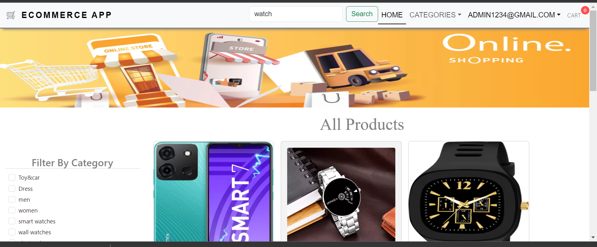
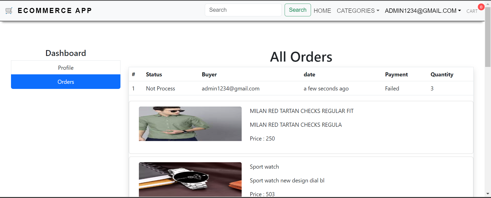
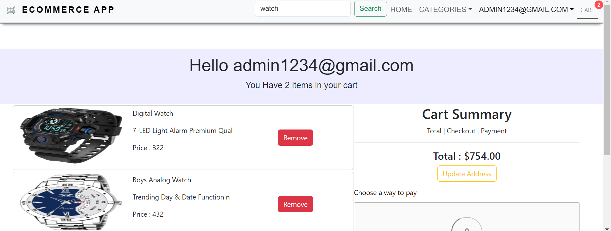

# RESPONSIVE | DYNAMIC

## Features

- Login / Register
- User's Can By A Product
- Admin Page / Admin Create a Product also Edit/Delete
- User Can Filter Product also sort
- Payment processing

## Tech

Dillinger uses a number of open source projects to work properly:

- React - HTML enhanced for web apps!
- Bootstrap - great UI boilerplate for modern web apps
- node.js / Express / Node - for the backend
- Css - for Style

And of course Dillinger itself is open source with a [public repository][dill]
on GitHub.

## Snippets of Our Website-

 
 

 
 

Backend Link => https://cute-blue-chimpanzee-hose.cyclic.app/

  Auth Router =>   https://cute-blue-chimpanzee-hose.cyclic.app/api/v1/auth
  
                   /login
                   /register
                   /forget-password
                   /user-auth
                   /admin-auth
                   /profile
                   /orders
                   /all-orders
                   /order-status/:orderId
                   
                   
  categoryRoutes => https://cute-blue-chimpanzee-hose.cyclic.app/api/v1/category
  
  // create category  
  
                    /create-category
  //update category      
  
                    /update-category/:id
  //getALl category                 
                    /get-category
   //single category                
                    /single-category/:slug
   //delete category                
                    /delete-category/:id
                    
                    

   
 Product Router=>   https://cute-blue-chimpanzee-hose.cyclic.app/api/v1/product

router.post(
    "/create-product",
    MustBeSigned,
    isAdmin,
    formidable(),
    createProductController
);
//routes
router.put(
    "/update-product/:pid",
    MustBeSigned,
    isAdmin,
    formidable(),
    updateProductController
);   
   
//get products
router.get("/get-product", getProductController);

//single product
router.get("/get-product/:slug", getSingleProductController);

//get photo
router.get("/product-photo/:pid", productPhotoController);

//delete rproduct
router.delete("/delete-product/:pid", deleteProductController);

//filter product
router.post("/product-filters", productFiltersController);

//product count
router.get("/product-count", productCountController);

//product per page
router.get("/product-list/:page", productListController);

//search product
router.get("/search/:keyword", searchProductController);

//similar product
router.get("/related-product/:pid/:cid", realtedProductController);

//category wise product
router.get("/product-category/:slug", productCategoryController);

//payments routes
//token
router.get("/braintree/token", braintreeTokenController);

//payments
router.post("/braintree/payment", MustBeSigned, brainTreePaymentController);

